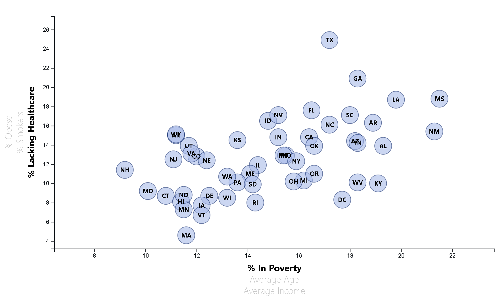

# D3 Homework - Data Journalism and D3

## Background

The data set included with the assignment is based on 2014 ACS 1-year estimates from the [US Census Bureau](https://data.census.gov/cedsci/) with data on state rates of poverty, age, income, healthcare, obesity, and smoking. 

D3, Javascript, HTML and CSS were used in this exercise.

The final app can be viewed at: <**add web link**>.

- - -

## Required Assignment: D3 Dabbler

Using D3, created a scatter plot between two of the data variables `Healthcare vs. Poverty`.

- - -

## Bonus Assignment

Make graph(s) dynamic and interactive.

* More demographics and risk factors were added. Additional axis labels have click events so that users can decide which data to display. Animated the transitions were applied.

* Tooltips were added to reveal specific data when the user hovers the cursor over the element. 

- - -

